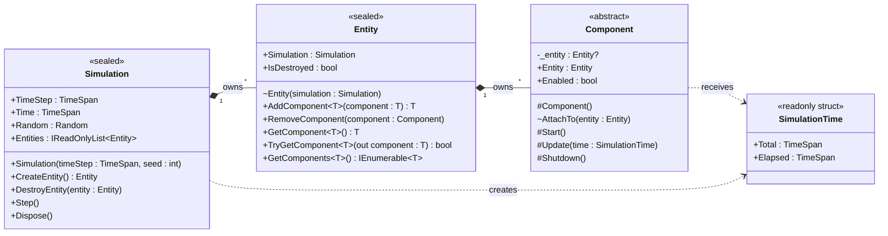
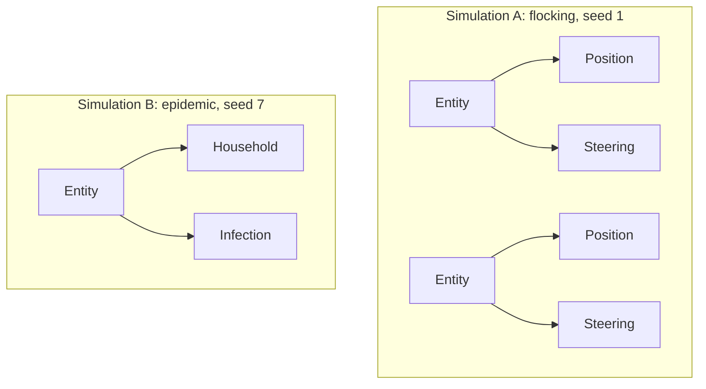
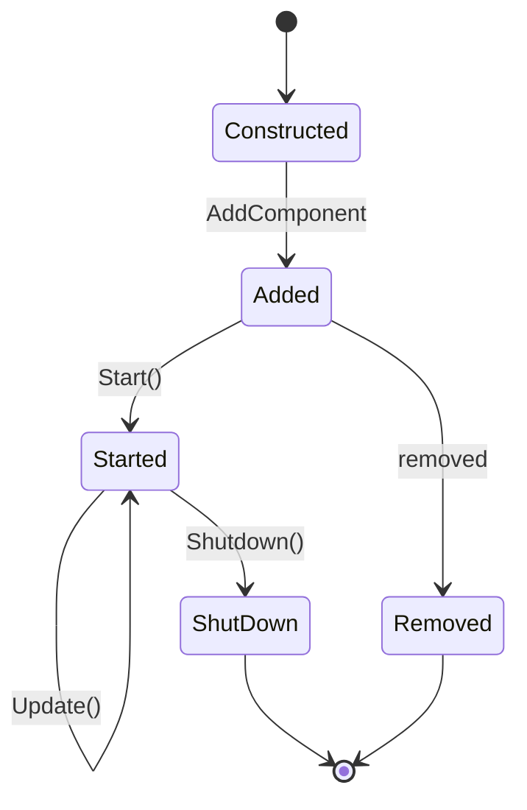
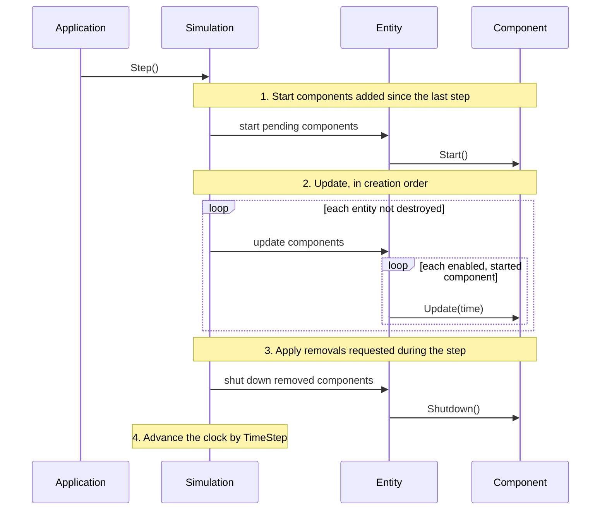

# Invicta.Simulation design

This document sets out the object-oriented design of the library's core types: what each one is responsible for, how
they fit together, and how applications extend them. It builds on [the patterns document](patterns.md) and stops
short of implementation. The C# blocks outline public surfaces and show how an application would use them; they omit
method bodies, so the outlines do not compile.

## Requirements

- **Patterns:** the library implements the Update Method and Component patterns for time-stepped simulations.
- **Independent simulations:** an application can create any number of simulations, of the same or unrelated
  models, and run them at the same time, including on different threads. Nothing may be static or a singleton.
- **Reproducibility:** a simulation created with the same seed and the same set-up produces the same run.
- **No domain knowledge:** the library knows nothing about what is being simulated; applications supply all of it.

The library does not cover rendering, pacing a run against the wall clock, saving and loading state, or updating
parts of one simulation in parallel. Applications can build those on top.

## Building blocks

The sources in the patterns document describe the same few roles under different names. Each maps onto one library
type, or is left to the application on purpose.

| Role in the patterns             | Invicta.Simulation         | Responsibility                                       |
|----------------------------------|----------------------------|------------------------------------------------------|
| World, or owner of the loop      | `Simulation`               | Owns entities, clock and random numbers; runs steps  |
| Container object or actor        | `Entity`                   | Groups the components that make up one thing         |
| Component                        | `Component`                | One aspect of an entity's state and behaviour        |
| Elapsed time for an update       | `SimulationTime`           | The span of simulated time one update covers         |
| Update Method                    | `Component.Update`         | Advances one component by one step                   |
| Lifecycle hooks                  | `Start`, `Shutdown`        | Set-up before the first update, tear-down after      |
| Shared state on the container    | None                       | Components hold all domain state                     |
| Messaging through the container  | None                       | Direct references or C# events instead               |
| Templates that assemble entities | Application code           | Too model-specific to generalise                     |
| Simulation-wide services         | Application code           | Passed to components when they are constructed       |
| The loop, or Game Loop           | Application code           | Calls `Simulation.Step` as often as it needs         |

Four public types make up the library:

- **`Simulation`:** the root of one run. It owns a list of entities, the current simulated time, the fixed time step
  and a seeded random number generator. `Step` advances everything by one time step.
- **`Entity`:** a thin, behaviourless container that belongs to one simulation and owns an ordered list of
  components. What an entity *is* comes entirely from its components.
- **`Component`:** the abstract base class that applications derive from. A component belongs to one entity and
  overrides some or all of the lifecycle hooks `Start`, `Update` and `Shutdown`.
- **`SimulationTime`:** an immutable value passed to `Update`, giving the simulated time at the start of the step and
  the length of the step.

### Class diagram

Members use UML notation, `name : Type`, with `+` for public, `#` protected, `~` internal and `-` private.



`Start`, `Update` and `Shutdown` are protected virtual methods with empty bodies. Applications override the ones they
need. The library's own bookkeeping, such as the lists of pending changes and each component's lifecycle state, is
internal or private and does not appear here.

## Ownership and independent simulations

Every object belongs to exactly one owner, for its whole life:



Two simulations share nothing, so they can run side by side, on the same thread or different ones. That depends on
the following rules.

- **No static mutable state:** the library has no static `Current` simulation, no static ID counters and no use of
  `Random.Shared`. Everything a component needs is reachable from its owner, as in `Entity.Simulation.Random`.
- **Ownership is fixed:** entities are created by their simulation, through `CreateEntity`, so none exists outside
  one. A component can be added to one entity only, once; adding it to a second entity, or again after removal,
  throws. An entity never moves between simulations.
- **Randomness belongs to the simulation:** each simulation owns a `Random` created from its seed, and components
  draw from it. Two simulations with different seeds are independent; two with the same seed and set-up repeat
  each other.
- **One thread per simulation:** a simulation is not thread-safe, which matches `System.Random` and the Update
  Method's sequential model. Different simulations can run on different threads because they share no state.

The library cannot stop application code breaking these rules, for example with a static field in a component. The
documentation for application authors must say so.

### Where other engines use singletons

Game engines usually put world-wide services, such as a spatial index or the current scenario's settings, in
singletons: Godot's autoloads, which its documentation calls singletons, and the manager-singleton idiom common in
Unity projects. Invicta cannot do that, so simulation-wide state lives in ordinary objects that the application passes
to components when it constructs them:

```csharp
Entity field = simulation.CreateEntity();
Pasture pasture = field.AddComponent(new Pasture(capacity: 500.0));

Entity sheep = simulation.CreateEntity();
Energy energy = sheep.AddComponent(new Energy());
sheep.AddComponent(new Grazing(pasture, energy));
```

The shared object can be a component on its own entity, as here, which lets it update each step like anything else;
or it can be a plain object that never updates. Either way, the reference is per simulation, the compiler checks
its type, and tests can pass a different one. The library needs no feature for this.

## The types in detail

### `Simulation`

```csharp
public sealed class Simulation : IDisposable
{
    public Simulation(TimeSpan timeStep, int seed);

    public TimeSpan TimeStep { get; }
    public TimeSpan Time { get; }
    public Random Random { get; }
    public IReadOnlyList<Entity> Entities { get; }

    public Entity CreateEntity();
    public void DestroyEntity(Entity entity);
    public void Step();
    public void Dispose();
}
```

- **Responsibilities:** owns the entities in creation order, the clock and the random number generator; applies
  structural changes at step boundaries; and drives the component lifecycle.
- **One step per call:** `Step` runs exactly one fixed step. Running until a condition holds, pacing against the
  wall clock, or catching up with an accumulator as Fiedler describes are loops that the application writes around
  `Step`, because each application wants a different one.
- **Fixed step:** the time step is set at construction and never changes, for the reproducibility and stability
  reasons given in the patterns document.
- **Disposal:** `Dispose` shuts down every started component, so that components holding resources, such as an output
  file, can release them. A disposed simulation cannot step.
- **Sealed:** applications extend a simulation by composition: by adding entities and components, not by
  deriving from `Simulation`. MASON's `SimState` and XNA's `Game` are designed to be subclassed; the cost is a base
  class whose overridable hooks and protected state become part of the library's contract, and model state that
  components can only reach by casting their simulation to the derived type. Constructor injection, described
  above, gives components typed access to the same state without either cost.

### `Entity`

```csharp
public sealed class Entity
{
    internal Entity(Simulation simulation);

    public Simulation Simulation { get; }
    public bool IsDestroyed { get; }

    public T AddComponent<T>(T component)
        where T : Component;

    public void RemoveComponent(Component component);

    public T GetComponent<T>();
    public bool TryGetComponent<T>([MaybeNullWhen(false)] out T component);
    public IEnumerable<T> GetComponents<T>();
}
```

- **Responsibilities:** holds an ordered list of components, finds them by type, and passes lifecycle calls from
  the simulation on to them. It has no behaviour or domain state of its own.
- **Created by its simulation:** the constructor is internal, so `Simulation.CreateEntity` is the only way to make
  one. This fixes ownership from the start and rules out an entity that belongs to no simulation.
- **Components are supplied from outside:** `AddComponent` takes an instance that the caller constructed, Nystrom's
  "external provision". This allows constructor injection, and lets a component take whatever constructor
  arguments it needs. It returns its argument, typed, so that the caller can keep the reference.
- **Lookups by type:** `GetComponent<T>` returns the first component assignable to `T`, so `T` can be an interface
  such as `IMovement`, and throws when there is none. `TryGetComponent` is the non-throwing form, and
  `GetComponents` returns every match. An entity can hold several components of one type, such as two sensors.
  `GetComponents<Component>()` returns them all, so the entity needs no separate `Components` property; having
  both would also trip analyser rule CA1721, which flags a property and a `Get` method with confusable names.
- **Sealed:** deriving from `Entity` would rebuild the class hierarchy the Component pattern exists to replace;
  Bilas's advice for *Dungeon Siege* was to derive from the component base only. An application that wants to name a
  kind of entity writes a factory method that assembles its components, and can add a marker component, such as
  `Sheep`, if other code needs to recognise that kind.

### `Component`

```csharp
public abstract class Component
{
    private Entity? _entity;

    protected Component();

    public Entity Entity => _entity ?? throw new InvalidOperationException(…);
    public bool Enabled { get; set; }

    internal void AttachTo(Entity entity);

    protected virtual void Start();
    protected virtual void Update(SimulationTime time);
    protected virtual void Shutdown();
}
```

- **Responsibilities:** one aspect of an entity: its state and the behaviour that changes it.
- **Hooks are protected:** code outside a component cannot call its `Start`, `Update` or `Shutdown`. The library calls
  them through internal, non-virtual methods on `Component` that check the lifecycle state first, so no component
  updates before it has started or after it has shut down. This is the non-virtual interface idiom: the library owns
  when a hook runs, and the application owns what it does.
- **Hooks are optional:** each has an empty default. Many components only hold state, such as a position or a
  household, and should not need empty overrides. A component that overrides no hook still costs one virtual call
  per step, which is negligible at the scale this library targets.
- **Hook names:** `Start` and `Update` follow Unity and the patterns. The tear-down hook is `Shutdown` rather than
  `Stop`, because `Stop` is a Visual Basic keyword and analyser rule CA1716 flags virtual members named after
  keywords.
- **`Entity` is set when the component is added:** `Entity.AddComponent` calls the internal `AttachTo`, which
  stores the owner in a private field. Applications cannot call `AttachTo`, so `AddComponent` is the only way to set
  the owner. `AddComponent` calls it before putting the component in any list, so if it throws, the entity is left
  unchanged.
- **`Entity` is never nullable:** the property throws `InvalidOperationException` until the component has been
  added. Every hook runs after that, so a nullable property would force a null check that can never fail.
- **The owner is set once:** `AttachTo` throws if the component already has an owner, which covers adding it to a
  second entity and re-adding it after removal. Removal never clears the field, so `Shutdown` can still reach
  `Entity.Simulation`.
- **`Enabled`:** a disabled component keeps its state and its place in the order but receives no `Update` calls,
  as in XNA and Unity. `Start` and `Shutdown` still run.
- **An abstract class, not an interface:** the library must track each component's owner and lifecycle state, and
  those members must not be implementable, or re-implementable, by applications. An `IComponent` interface would let
  any object claim to be a component while bypassing the bookkeeping. XNA offered both `IGameComponent` and
  `GameComponent`; Unity and Unreal use only a base class.
- **Application components:** applications derive their components directly from `Component` and should normally
  seal them. A family of related components can share an abstract base in the application, such as a `Movement`
  base with `Walking` and `Flying` subclasses, where `GetComponent<Movement>()` finds either.

### `SimulationTime`

```csharp
public readonly record struct SimulationTime(TimeSpan Total, TimeSpan Elapsed);
```

- **Meaning:** an `Update` call advances its component from `Total` to `Total + Elapsed`. `Total` is the simulated
  time at the start of the step, and `Elapsed` is the length of the step.
- **Why pass it at all:** with a fixed step, components could read the same values from the simulation. Passing a
  value follows the Update Method as every source describes it, makes each update's inputs explicit, and leaves
  room for a variable step without changing any component's signature.
- **Value type:** it is small, immutable and created once per step.

## Lifecycle

### Component states



- **Added:** the component belongs to an entity but has not started. `Start` runs at the beginning of the next step.
- **Started:** `Update` runs once per step while the component is enabled.
- **ShutDown:** `Shutdown` runs when the component is removed, its entity is destroyed, or the simulation is disposed.
- **Removed:** a component removed before it started never runs any hook.

A component passes through these states once. It cannot be re-added after removal, which keeps its invariants
simple: `Start` runs at most once, and `Shutdown` runs only if `Start` did.

### One step



- **Start before any update:** every component added since the last step starts before any component updates. By
  then, every component added in the same batch is attached, so a `Start` hook can find its siblings.
- **Order:** entities update in the order they were created, and each entity's components in the order they were
  added. The order is fixed and easy to predict, which keeps runs reproducible. Phases and randomised order are
  discussed under [Deferred features](#deferred-features).
- **Entity by entity:** each entity updates all its components before the next entity starts. The alternative,
  updating every entity's first component and then every entity's second, is Mesa's staged activation; it is listed
  as an open question.

### Structural changes

| Change                         | Between steps                      | During a step                                |
|--------------------------------|------------------------------------|----------------------------------------------|
| `CreateEntity`, `AddComponent` | Added now; starts at the next step | Added now; starts at the next step           |
| `RemoveComponent`              | Removed and shut down now          | Not updated again; shut down at the step end |
| `DestroyEntity`                | Destroyed and shut down now        | `IsDestroyed` set now; shut down at the end  |

During a step, a component or entity added mid-step does not update until the next step, and one removed mid-step
does not update again. These are Nystrom's recommendations: deferring removal means no entity is skipped or visited
twice while the lists are being walked, and marking entities as destroyed lets other components tell that an entity
is gone before its removal takes effect. `Step` called from inside a hook throws `InvalidOperationException`.

## Communication between components

- **Direct references, by injection:** when the application assembles an entity in code, it passes each component
  the siblings and shared objects it depends on, as in the pasture example. This is Nystrom's "direct reference"
  option, and the compiler checks it.
- **Direct references, by lookup:** a component can instead find its siblings in `Start`, using `GetComponent<T>`,
  and keep them in fields. This suits entities assembled from data, where constructors cannot be wired by hand. It
  costs a field that is not set in the constructor, which C#'s nullable annotations will flag, so injection is the
  better default.
- **Events:** a component that wants to announce something, such as an infection or a death, declares an ordinary
  C# event, and interested components subscribe in `Start` and unsubscribe in `Shutdown`.
- **No message bus and no shared state on `Entity`:** Nystrom's messaging option and his shared container state
  both need either a domain vocabulary or untyped messages. The library has neither, and C#'s own references and
  events cover the need. Either can be added later without changing the types above.

## Accessibility and extensibility

| Type or member                   | Access    | Extension      | Reason                                          |
|----------------------------------|-----------|----------------|-------------------------------------------------|
| `Simulation`                     | Public    | Sealed         | Extended by composition, not inheritance        |
| `Simulation` constructor         | Public    | n/a            | Applications create as many as they need        |
| `Entity`                         | Public    | Sealed         | Behaviour belongs in components                 |
| `Entity` constructor             | Internal  | n/a            | Only a simulation creates entities              |
| `Component`                      | Public    | Abstract       | The type applications derive from               |
| `Component` constructor          | Protected | n/a            | Only derived classes construct it               |
| `Start`, `Update`, `Shutdown`    | Protected | Virtual, empty | Only the library calls them                     |
| `Component.Entity`, `Enabled`    | Public    | Non-virtual    | Managed by the library                          |
| `Component.AttachTo`             | Internal  | Non-virtual    | Only `AddComponent` sets the owner              |
| Methods that invoke the hooks    | Internal  | Non-virtual    | Enforce the lifecycle before each hook          |
| `SimulationTime`                 | Public    | n/a (struct)   | Passed to every update                          |
| Pending changes, lifecycle state | Private   | n/a            | Implementation detail                           |

The public surface is four types. Everything an application does is create simulations, create entities, derive
and add components, and call `Step`.

## Namespaces

The workspace convention puts types in `Invicta` unless they mirror a `System` namespace, and none of these do. That
gives `Invicta.Simulation`, `Invicta.Entity`, `Invicta.Component` and `Invicta.SimulationTime`, in the
`Invicta.Simulation` assembly. It also avoids the usual problem of a type named after its own namespace: with
`Invicta.Simulation` as a namespace, the main type would be `Invicta.Simulation.Simulation`, which the
Framework Design Guidelines advise against.

## An application's view

A sketch of a grazing model, run ten times in parallel with different seeds:

```csharp
internal sealed class Pasture(double capacity)
    : Component
{
    private readonly double _capacity = capacity;

    public double Biomass { get; private set; } = capacity;

    public double Graze(double demand)
    {
        double eaten = double.Min(demand, Biomass);
        Biomass -= eaten;
        return eaten;
    }

    protected override void Update(SimulationTime time)
    {
        Biomass = double.Min(_capacity, Biomass + (_capacity * 0.05 * time.Elapsed.TotalDays));
    }
}

internal sealed class Energy : Component
{
    public double Reserve { get; set; } = 10.0;
}

internal sealed class Grazing(Pasture pasture, Energy energy)
    : Component
{
    protected override void Update(SimulationTime time)
    {
        double appetite = 1.0 + Entity.Simulation.Random.NextDouble();
        energy.Reserve += pasture.Graze(appetite * time.Elapsed.TotalDays) - time.Elapsed.TotalDays;
        if (energy.Reserve <= 0.0)
        {
            Entity.Simulation.DestroyEntity(Entity);
        }
    }
}

internal static class Program
{
    private static void Main()
    {
        Parallel.For(0, 10, RunScenario);
    }

    private static void RunScenario(int seed)
    {
        using Simulation simulation = new(TimeSpan.FromDays(1), seed);

        Pasture pasture = simulation.CreateEntity().AddComponent(new Pasture(capacity: 500.0));
        for (int i = 0; i < 20; i++)
        {
            CreateSheep(simulation, pasture);
        }

        for (int day = 0; day < 365; day++)
        {
            simulation.Step();
        }
    }

    private static Entity CreateSheep(Simulation simulation, Pasture pasture)
    {
        Entity sheep = simulation.CreateEntity();
        Energy energy = sheep.AddComponent(new Energy());
        sheep.AddComponent(new Grazing(pasture, energy));

        return sheep;
    }
}
```

The sketch shows:

- **Independence:** ten simulations run at once, and nothing in them is static.
- **Composition:** a sheep is whatever `CreateSheep` assembles. There is no `Sheep` class.
- **Injection:** `Grazing` receives the pasture it shares with the other sheep, and its sibling `Energy`, through
  its constructor.
- **Deferred removal:** a starving sheep destroys its own entity mid-step, safely.

> [!NOTE]
> Analyser rule CA5394 flags every call to `Random` as insecure. Models draw from `Simulation.Random` for
> reproducibility, not security, so application projects will need a justified suppression for it.

## Deferred features

The sources describe more than this design includes. Each item below is left out until a model needs it, and each
can be added later without breaking code written against the types above.

- **Update order:** an explicit order value, as in XNA's `UpdateOrder`; phases per step, as in Unity's `LateUpdate`
  or Mesa's staged activation; or order shuffled with the simulation's generator, as in MASON and Mesa.
- **Simultaneous update:** a two-phase compute-then-commit step. For now, components that need it can keep current
  and next values themselves, as Nystrom's Double Buffer describes.
- **Entity hierarchy:** entities that contain entities, as in Unity's transforms or DEVS coupled models.
- **Data-driven assembly:** templates that build entities from configuration, as in *Dungeon Siege*.
- **Messaging:** a message bus on the entity or the simulation.
- **Entity identity:** a per-simulation ID or name, for output and debugging.
- **Disabling whole entities:** `Enabled` exists on components only.
- **Checkpointing:** saving and restoring a simulation's state.

## Open questions

These are decisions for you before implementation starts. Each has a recommendation.

1. **Representation of time:** `TimeSpan` is unit-safe and a base library type, but its resolution is 100 ns and
   it suits calendar-like models better than dimensionless ones. The alternative is `double` in model-defined
   units. Recommended: `TimeSpan`.
2. **Fixed or variable step:** recommended: fixed only. `SimulationTime` leaves room to add a variable step later.
3. **Update order:** entity by entity, in creation order, or component type by component type (staged)?
   Recommended: entity by entity for now, adding staged ordering when a model needs it.
4. **Name clash:** `Invicta.Component` is ambiguous with `System.ComponentModel.Component` in any file that imports
   both namespaces, which is common in Windows Forms code, for example a visualisation front end. The alternative
   is a longer name such as `SimulationComponent`. Recommended: keep `Component`, the pattern's own name, and use a
   using alias where the clash arises.
5. **Reproducibility across .NET versions:** [the documentation for `System.Random`][random] warns that a seed may
   produce a different sequence on a different version of .NET. Runs repeat within one version, but not
   necessarily after an upgrade. Recommended: accept this for now; if runs must repeat across upgrades, the library
   will need a generator with a fixed algorithm.
6. **Exceptions from hooks:** if `Update` throws partway through a step, some components have advanced and others
   have not. Recommended: let the exception propagate and mark the simulation as faulted, so that later calls to
   `Step` throw rather than continue from an inconsistent state.

[random]: https://learn.microsoft.com/dotnet/fundamentals/runtime-libraries/system-random
