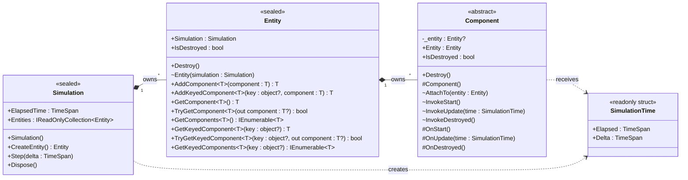
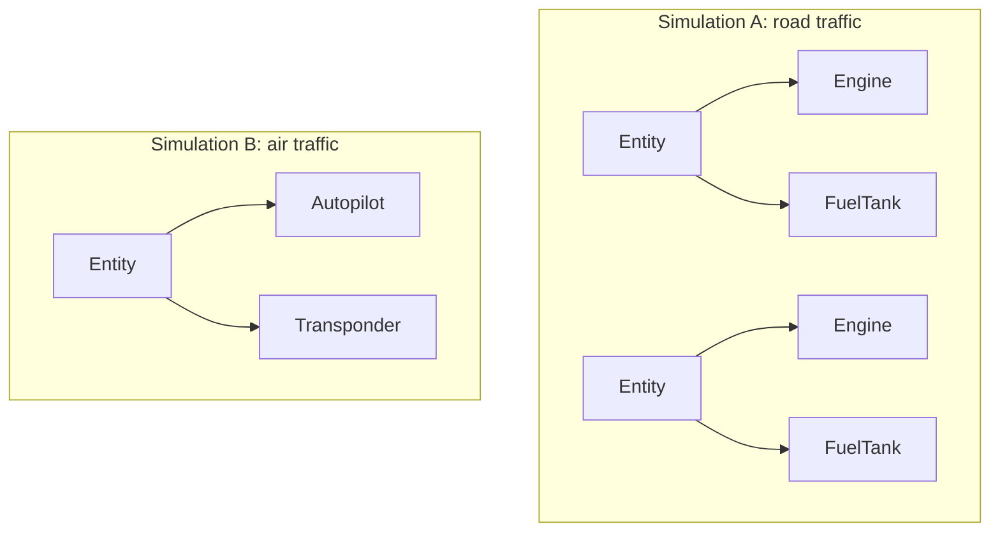
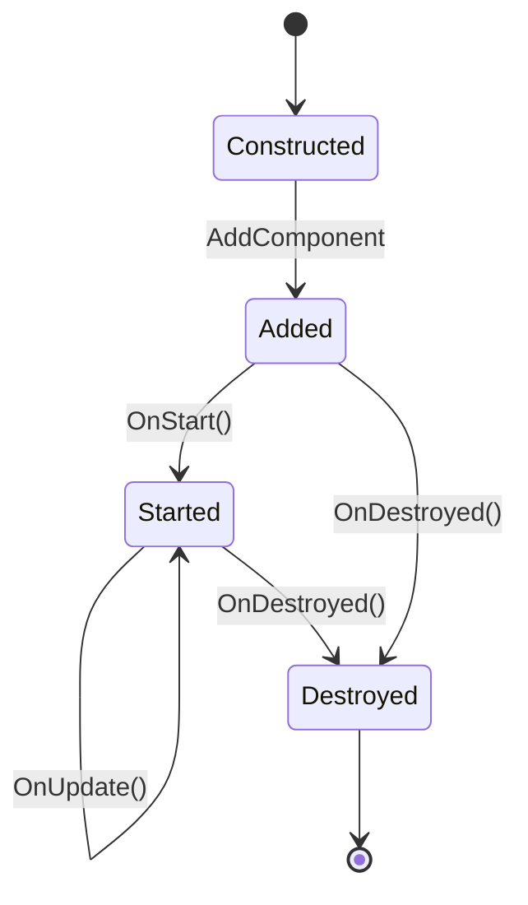
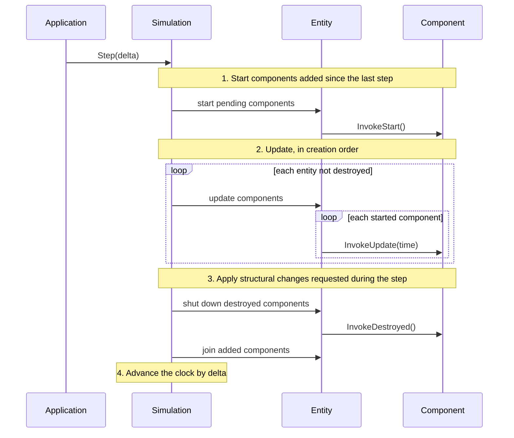

# Invicta.Simulation design

This document sets out the object-oriented design of the library's core types: what each one is responsible for, how
they fit together, and how applications extend them. It builds on [the patterns document](patterns.md) and stops
short of implementation. The C# blocks outline public surfaces and show how an application would use them; they omit
method bodies, so the outlines do not compile.

## Requirements

- **Patterns:** the library implements the Update Method and Component patterns for time-stepped simulations.
- **Independent simulations:** an application can create any number of simulations, of the same or unrelated
  models, and run them at the same time, including on different threads. Nothing may be static or a singleton.
- **Reproducibility:** a simulation built the same way, and stepped with the same sequence of step lengths,
  produces the same run. Any randomness belongs to the model, so a model that wants repeatable runs supplies its
  own generator.
- **No domain knowledge:** the library knows nothing about what is being simulated; applications supply all of it.

The library does not cover rendering, pacing a run against the wall clock, saving and loading state, or updating
parts of one simulation in parallel. Applications can build those on top.

## Building blocks

The sources in the patterns document describe the same few roles under different names. Each maps onto one library
type, or is left to the application on purpose.

| Role in the patterns             | Invicta.Simulation         | Responsibility                                       |
|----------------------------------|----------------------------|------------------------------------------------------|
| World, or owner of the loop      | `Simulation`               | Owns the entities and the clock; runs steps          |
| Container object or actor        | `Entity`                   | Groups the components that make up one thing         |
| Component                        | `Component`                | One aspect of an entity's state and behaviour        |
| Elapsed time for an update       | `SimulationTime`           | The span of simulated time one update covers         |
| Update Method                    | `Component.OnUpdate`       | Advances one component by one step                   |
| Lifecycle hooks                  | `OnStart`, `OnDestroyed`   | Set-up before the first update, tear-down after      |
| Shared state on the container    | None                       | Components hold all domain state                     |
| Messaging through the container  | None                       | Direct references or C# events instead               |
| Templates that assemble entities | Application code           | Too model-specific to generalise                     |
| Simulation-wide services         | Application code           | Passed to components when they are constructed       |
| The loop, or Game Loop           | Application code           | Calls `Simulation.Step` with each step's length      |

Four public types make up the library:

- **`Simulation`:** the root of one run. It owns a list of entities and the current simulated time. `Step`
  advances everything by a step of the length the caller gives.
- **`Entity`:** a thin, behaviourless container that belongs to one simulation and owns an ordered list of
  components. What an entity *is* comes entirely from its components.
- **`Component`:** the abstract base class that applications derive from. A component belongs to one entity and
  overrides some or all of the lifecycle hooks `OnStart`, `OnUpdate` and `OnDestroyed`.
- **`SimulationTime`:** an immutable value passed to `OnUpdate`, giving the simulated time at the start of the step and
  the length of the step.

### Class diagram

Members use UML notation, `name : Type`, with `+` for public, `#` protected, `~` internal and `-` private.



`OnStart`, `OnUpdate` and `OnDestroyed` are protected virtual methods with empty bodies, which applications
override as they need. The library's own bookkeeping, such as the `Invoke…` methods that call those hooks, the
lists of pending changes and each component's lifecycle state, is internal or private and does not appear here.

## Ownership and independent simulations

Every object belongs to exactly one owner, for its whole life:



Two simulations share nothing, so they can run side by side, on the same thread or different ones. That depends on
the following rules.

- **No static mutable state:** the library has no static `Current` simulation, no static ID counters and no use of
  `Random.Shared` anywhere. Everything a component needs is reachable from its owner, as in `Entity.Simulation`,
  or was passed to it when it was constructed.
- **Ownership is fixed:** entities are created by their simulation, through `CreateEntity`, so none exists outside
  one. A component can be added to one entity only, once; adding it to a second entity, or again after it has been
  destroyed, throws. An entity never moves between simulations.
- **Randomness belongs to the model:** the library has no generator of its own. A model that needs random numbers
  creates one per simulation and passes it to the components that draw from it, in the same way as any other
  simulation-wide object. Two simulations then share no generator, and a run repeats when its generator is seeded
  the same way.
- **One thread per simulation:** a simulation is not thread-safe, which matches the Update Method's sequential
  model. Different simulations can run on different threads because they share no state.

The library cannot stop application code breaking these rules, for example with a static field in a component. The
documentation for application authors must say so.

### Where other engines use singletons

Game engines usually put world-wide services, such as a spatial index or the current scenario's settings, in
singletons: Godot's autoloads, which its documentation calls singletons, and the manager-singleton idiom common in
Unity projects. Invicta cannot do that, so simulation-wide state lives in ordinary objects that the application passes
to components when it constructs them:

```csharp
Entity forecourt = simulation.CreateEntity();
FuelDepot depot = forecourt.AddComponent(new FuelDepot(capacity: 500.0));

Entity car = simulation.CreateEntity();
FuelTank tank = car.AddComponent(new FuelTank());
car.AddComponent(new Engine(depot, tank));
```

The shared object can be a component on its own entity, as here, which lets it update each step like anything else;
or it can be a plain object that never updates. Either way, the reference is per simulation, the compiler checks
its type, and tests can pass a different one. The library needs no feature for this.

## The types in detail

### `Simulation`

```csharp
public sealed class Simulation : IDisposable
{
    public Simulation();

    public TimeSpan ElapsedTime { get; }
    public IReadOnlyCollection<Entity> Entities { get; }

    public Entity CreateEntity();
    public void Step(TimeSpan delta);
    public void Dispose();
}
```

- **Responsibilities:** owns the entities in creation order and the clock; applies structural changes at step
  boundaries; and drives the component lifecycle.
- **One step per call:** `Step` runs exactly one step. Running until a condition holds, pacing against the wall
  clock, or catching up with an accumulator as Fiedler describes are loops that the application writes around
  `Step`, because each application wants a different one.
- **The caller chooses each step's length:** `Step` takes the length of the step, which must be positive; zero or a
  negative length throws `ArgumentOutOfRangeException`. A model with a fixed step passes the same value every time,
  and one driven by the wall clock passes the real time elapsed. The patterns document explains why a fixed step
  is still the better default: it keeps runs reproducible and numerical methods stable. The library supports both
  and leaves the choice to the application.
- **`Entities`:** the simulation's entities in creation order. During a step it lists the entities as they were
  at the start of the step: entities created in the step are not yet included, and destroyed ones are still listed,
  as described under [Structural changes](#structural-changes). It follows two rules:
  - **A live view:** the property returns the same read-only collection object on every access, and its `Count` and
    every new enumeration reflect the current state. A caller that keeps a reference to it never sees stale
    contents, as with `List<T>.AsReadOnly()` or `Dictionary<TKey, TValue>.Keys`. Returning a copy instead would be
    a method, such as `GetEntities()`, because the Framework Design Guidelines put copies behind methods; a stored
    copy would silently go stale.
  - **Snapshot enumeration:** each enumeration sees the entities as they were when it began, so creating or
    destroying entities inside a `foreach` over `Entities` is safe and never throws "collection was modified".
    The documentation for `ConcurrentBag<T>` and `ConcurrentQueue<T>` describes their enumerations in the same
    way, as moment-in-time snapshots. The implementation takes the copy only when the structure has changed since
    the last one, so repeated enumerations of an unchanged simulation cost nothing extra.

  The type is `IReadOnlyCollection<Entity>`, not `IReadOnlyList<Entity>`. A position in the collection is not an
  identity, because it shifts whenever an entity is destroyed, so the collection promises a count and enumeration
  in creation order but no indexer. The implementation remains free to store the entities in something other than
  a list.
- **`ElapsedTime`:** the simulated time elapsed since the start of the run. It advances by the step's length at the
  end of `Step`, so throughout a step it equals the `Elapsed` passed to `OnUpdate`.
- **Destruction belongs to the object:** an entity is destroyed through `Entity.Destroy` and a component through
  `Component.Destroy`, not through a method on their owner. Each knows its own owner, so neither call can name the
  wrong one, and the argument checks that `DestroyEntity(entity)` and `RemoveComponent(component)` would have
  needed do not exist. Creation stays with the owner, because the owner is what makes the object: the simulation
  creates entities, and the caller hands components to an entity.
- **Disposal:** `Dispose` shuts down every component its entities hold, whether or not they started, so that
  components holding resources, such as an output file, can release them. A disposed simulation cannot step.
- **Sealed:** applications extend a simulation by composition: by adding entities and components, not by
  deriving from `Simulation`. MASON's `SimState` and XNA's `Game` are designed to be subclassed; the cost is a base
  class whose overridable hooks and protected state become part of the library's contract, and model state that
  components can only reach by casting their simulation to the derived type. Constructor injection, described
  above, gives components typed access to the same state without either cost.

### `Entity`

```csharp
public sealed class Entity
{
    internal Entity(Simulation simulation);

    public Simulation Simulation { get; }
    public bool IsDestroyed { get; }

    public void Destroy();

    public T AddComponent<T>(T component)
        where T : Component;

    public T AddKeyedComponent<T>(object? key, T component)
        where T : Component;

    public T GetComponent<T>()
        where T : class;

    public bool TryGetComponent<T>([NotNullWhen(true)] out T? component)
        where T : class;

    public IEnumerable<T> GetComponents<T>()
        where T : class;

    public T GetKeyedComponent<T>(object? key)
        where T : class;

    public bool TryGetKeyedComponent<T>(object? key, [NotNullWhen(true)] out T? component)
        where T : class;

    public IEnumerable<T> GetKeyedComponents<T>(object? key)
        where T : class;
}
```

- **Responsibilities:** holds an ordered list of components, finds them by type, and passes lifecycle calls from
  the simulation on to them. It has no behaviour or domain state of its own.
- **Created by its simulation:** the constructor is internal, so `Simulation.CreateEntity` is the only way to make
  one. This fixes ownership from the start and rules out an entity that belongs to no simulation.
- **Components are supplied from outside:** `AddComponent` takes an instance that the caller constructed, Nystrom's
  "external provision". This allows constructor injection, and lets a component take whatever constructor
  arguments it needs. It returns its argument, typed, so that the caller can keep the reference.
- **Destroying components and entities:** `Component.Destroy` ends a component's life, and `Entity.Destroy` ends
  its entity's, taking every component the entity holds with it. Destruction is final: the object is shut down, it
  cannot be added again, and nothing should use it afterwards. Both methods take no argument, so there is no wrong
  owner to name and nothing to validate:
  - **Destroying twice:** does nothing. Two components can reasonably decide to destroy the same thing in the same
    step, and the first request wins.
  - **Destroying a component of an already destroyed entity:** does nothing, because the entity's components are
    being shut down anyway.
  - **Anyone can call it:** `Destroy` is public, so a component can end its own life, `Destroy()`, or another's,
    `other.Destroy()`. Putting the method on the object says where the effect lands, not who may call it.
  - **`IsDestroyed` on both:** each type reports whether it has been destroyed, and the flag is set the moment
    `Destroy` is called, not at the end of the step when the shutdown happens. Destroying an entity sets it on
    every component the entity holds. It never goes back, because destruction is final.

  Both return `void`. There is no `bool` to report, because every call either carries out the destruction or finds
  it already done.
- **Lookups by type:** a lookup matches every component assignable to `T`, so `T` can be an interface such as
  `IPropulsion`. Every lookup constrains `T` to `class`: a component is always a reference type, so a value type
  could never match, and the constraint turns a call such as `GetComponent<int>()` from a lookup that always fails
  into a compiler error. It also makes `T?` mean a nullable reference, which the `Try` methods rely on below. A
  single lookup never picks one match out of several:
  - **`GetComponent<T>`:** returns the only match. It throws `InvalidOperationException` when there is no match
    or more than one, like `Enumerable.Single`.
  - **`TryGetComponent<T>`:** returns `false` when there is no match and throws `InvalidOperationException` when
    there is more than one, like `Enumerable.SingleOrDefault`. Returning `false` for an ambiguous match would treat
    "two engines" as "no engine". Its parameter is `[NotNullWhen(true)] out T?`, so the declared type is honest
    about the failing case while the caller gets a non-null value inside the `if`. `IPAddress.TryParse` and
    `Uri.TryCreate` annotate their reference-type results the same way; `Dictionary<TKey, TValue>.TryGetValue` uses
    `[MaybeNullWhen(false)] out TValue` instead only because `TValue` is unconstrained, where `TValue?` would mean
    nothing for a value type.
  - **`GetComponents<T>`:** returns every match, in the order the components were added. An entity can hold several
    components of one type, such as two headlamps, and code that wants them all asks for them all. Like a LINQ
    query, the result is evaluated when it is enumerated, and it follows the same snapshot rule as
    `Simulation.Entities`: each enumeration sees the entity's components as they were when it began, so adding or
    destroying components inside a `foreach` over it is safe. `GetKeyedComponents<T>` behaves the same way.

  Returning the first or last match would pick a component silently when a second one is added, which is a
  well-known source of bugs in engines that do it. The error message names every match, so the fix is clear: look
  up by a narrower type, or add the components under keys. The price is that adding a component can make someone
  else's lookup ambiguous. That is intended, but it makes lookups by broad types, such as a marker interface,
  fragile. Every lookup scans all of the entity's components rather than stopping at the first match, which costs
  little because entities hold few components.

  `GetComponents<Component>()` returns every unkeyed component, so the entity has no separate `Components` property;
  having both would also trip analyser rule CA1721, which flags a property and a `Get` method with confusable names.
- **Lookups see the structure at the start of the step:** during a step, lookups include components whose destruction
  is pending and leave out components added during the step, as described under
  [Structural changes](#structural-changes). The answer to a lookup therefore does not depend on where the caller
  comes in the update order.
- **Lookups by key:** `AddKeyedComponent` adds a component under a key, so that an entity can hold several
  components of one type that play different roles, such as a left and a right `Wheel`, and code can find each one
  by its role. The keyed methods mirror the keyed services of `Microsoft.Extensions.DependencyInjection`:
  - **Any object:** a key can be any object and is compared with `Equals` and `GetHashCode`. It should be immutable,
    such as a string or an enumeration value.
  - **`null` means unkeyed:** a `null` key is not a key. `AddKeyedComponent(null, component)` is the same as
    `AddComponent(component)`, and each keyed lookup with a `null` key is the same as its unkeyed counterpart:
    `GetKeyedComponent<T>(null)`, `TryGetKeyedComponent<T>(null, out …)` and `GetKeyedComponents<T>(null)` behave
    exactly like `GetComponent<T>()`, `TryGetComponent<T>(out …)` and `GetComponents<T>()`. A component added with a
    `null` key is therefore found by the unkeyed methods. The container behaves the same way:
    `AddKeyedSingleton<T>(null, instance)` registers an unkeyed service, which `GetService<T>()` returns.
  - **Unkeyed lookups ignore keyed components:** `GetService` never returns a service registered with a non-`null`
    key, and in the same way the unkeyed methods find only components whose key is `null`.
  - **Fixed when added:** a component's key is set by `AddKeyedComponent` and never changes. The entity stores it
    alongside the component, so `Component` needs no new members.
  - **Keys are scoped to their entity:** the same key on two entities, such as `"left"` on every vehicle, names
    two unrelated components.
- **Where keyed lookup differs from the container:**
  - **Several matches throw:** when more than one component matches, `GetKeyedComponent` and
    `TryGetKeyedComponent` throw `InvalidOperationException`, as the unkeyed lookups do, whereas `GetKeyedService`
    returns the last registration. The container's rule lets a later registration override an earlier one; an
    entity has no notion of overriding, so several matches can only mean an ambiguous lookup.
  - **No `AnyKey`:** `KeyedService.AnyKey` is defined in the `Microsoft.Extensions.DependencyInjection.Abstractions`
    package. Using it would add a dependency, so it is listed under [Deferred features](#deferred-features).
- **Sealed:** deriving from `Entity` would rebuild the class hierarchy the Component pattern exists to replace;
  Bilas's advice for *Dungeon Siege* was to derive from the component base only. An application that wants to name a
  kind of entity writes a factory method that assembles its components, and can add a marker component, such as
  `Car`, if other code needs to recognise that kind.

### `Component`

```csharp
public abstract class Component
{
    private Entity? _entity;

    protected Component();

    public Entity Entity => _entity ?? throw new InvalidOperationException(…);
    public bool IsDestroyed { get; }

    public void Destroy();

    internal void AttachTo(Entity entity);
    internal void InvokeStart();
    internal void InvokeUpdate(SimulationTime time);
    internal void InvokeDestroyed();

    protected virtual void OnStart();
    protected virtual void OnUpdate(SimulationTime time);
    protected virtual void OnDestroyed();
}
```

- **Responsibilities:** one aspect of an entity: its state and the behaviour that changes it.
- **Hooks are protected, and the library reaches them through `Invoke…`:** an entity cannot call another class's
  protected member, so each hook has an internal, non-virtual counterpart on `Component` itself, which checks the
  lifecycle state and then calls the hook:

  ```csharp
  internal void InvokeUpdate(SimulationTime time)
  {
      // Throws if the component has not started, or has been destroyed.

      OnUpdate(time);
  }
  ```

  `Entity` calls `component.InvokeUpdate(time)`, and nothing outside the library can call either method: the hook
  is protected and the counterpart is internal. This is the non-virtual interface idiom, so the library owns when a
  hook runs and the application owns what it does. The `Invoke…` prefix follows WinForms, where
  `Control.InvokePaint` runs another control's `OnPaint`.
- **Hooks are optional:** each has an empty default. Many components only hold state, such as a position or a
  fuel level, and should not need empty overrides. A component that overrides no hook still costs one virtual call
  per step, which is negligible at the scale this library targets.
- **Hook names:** the `On…` prefix marks every member the library calls on a component, so an application author
  can see at a glance what to override and what to call. `ServiceBase` names its framework callbacks the same way,
  with `OnStart` and `OnStop`, and Unity's are `Start`, `Update` and `OnDestroy`. `OnStart` and `OnUpdate` are in
  the present tense because they do the work; `OnDestroyed` is in the past tense because it reacts to a state that
  is already set, as `IsDestroyed` is `true` before it runs. The tear-down hook cannot be called `Stop` or `End`,
  because both are Visual Basic keywords and analyser rule CA1716 flags virtual members named after keywords.
- **`OnDestroyed` always runs:** every component that was added receives exactly one `OnDestroyed`, even one destroyed
  before its first step, and even if its `OnStart` threw. So a component can acquire what it needs in its constructor,
  keeping its fields `readonly` and non-nullable, and release them in `OnDestroyed`. A component that instead acquires
  something in `OnStart` must write an `OnDestroyed` that tolerates never having started, in the same way that `Dispose`
  has to cope with a partly constructed object.
- **Components that hold resources:** a component whose fields are disposable will be asked by analyser rule CA1001
  to implement `IDisposable`. The pattern is to put the clean-up in `Dispose`, make it safe to call twice, and have
  `OnDestroyed` call it:

  ```csharp
  protected override void OnDestroyed()
  {
      Dispose();
  }
  ```

  The library calls only `OnDestroyed`, for three reasons. Tear-down is broader than disposal: unsubscribing from a
  sibling's event or recording a final value has nothing to release, and components that hold no resources still
  need the hook. `OnDestroyed` is protected, so the library alone decides when it runs, whereas `Dispose` is public
  and an application can call it at any time, including on a component that is still attached and still updating.
  And calling `Dispose` would bring the rest of that contract with it, such as `IAsyncDisposable` and what a
  disposed but still attached component means.

  Two rules keep this open to change. A component's `Dispose` must be safe to call twice, as the standard contract
  requires, and nothing should use a component after its `OnDestroyed`. Disposing a component does not destroy it or
  take it out of its entity, so code that disposes one directly should call `Destroy` on it and let `OnDestroyed` do
  the work.
- **`Entity` is set when the component is added:** `Entity.AddComponent` calls the internal `AttachTo`, which
  stores the owner in a private field. Applications cannot call `AttachTo`, so `AddComponent` is the only way to set
  the owner. `AddComponent` calls it before putting the component in any list, so if it throws, the entity is left
  unchanged.
- **`Entity` is never nullable:** the property throws `InvalidOperationException` until the component has been
  added. Every hook runs after that, so a nullable property would force a null check that can never fail.
- **The owner is set once:** `AttachTo` throws if the component already has an owner, which covers adding it to a
  second entity and re-adding it after it has been destroyed. Destruction never clears the field, so `OnDestroyed` can
  still reach `Entity.Simulation`.
- **An abstract class, not an interface:** the library must track each component's owner and lifecycle state, and
  those members must not be implementable, or re-implementable, by applications. An `IComponent` interface would let
  any object claim to be a component while bypassing the bookkeeping. XNA offered both `IGameComponent` and
  `GameComponent`; Unity and Unreal use only a base class.
- **Application components:** applications derive their components directly from `Component` and should normally
  seal them. A family of related components can share an abstract base in the application, such as a `Propulsion`
  base with `JetEngine` and `Propeller` subclasses, where `GetComponent<Propulsion>()` finds either.

### `SimulationTime`

```csharp
public readonly record struct SimulationTime(TimeSpan Elapsed, TimeSpan Delta);
```

- **Meaning:** an `OnUpdate` call advances its component from `Elapsed` to `Elapsed + Delta`. `Elapsed` is the
  simulated time elapsed at the start of the step, and `Delta` is the length of the step, often written Δt.
- **The only source of the step's length:** a step can have any length, so `OnUpdate` receives it rather than reading
  a setting. Components must not work out per-step values, such as a per-step failure probability converted from an
  hourly failure rate, in `OnStart` and reuse them. They compute them in `OnUpdate` from `Delta`, or cache them
  against the `Delta` they were computed for.
- **Value type:** it is small, immutable and created once per step.

## Lifecycle

### Component states



- **Added:** the component belongs to an entity, and its `Entity` property is set, but it has not started. A
  component added during a step joins its entity's list at the end of that step. `OnStart` runs at the beginning of
  the next step.
- **Started:** `OnUpdate` runs once per step.
- **Destroyed:** `OnDestroyed` runs when the component is destroyed, its entity is destroyed, or the simulation is
  disposed. It runs whether or not the component started, so a component added and then destroyed before its first
  step still shuts down.

A component passes through these states once, and it cannot be re-added afterwards. That keeps the contract to two
sentences: `OnStart` runs at most once, and every component that was added receives exactly one `OnDestroyed`.

### One step



- **Start before any update:** every component that has joined since the last step starts before any component
  updates. Components that joined together are all in place by then, so a `OnStart` hook can find its siblings.
- **Order:** entities update in the order they were created, and each entity's components in the order they were
  added. The order is fixed and easy to predict, which keeps runs reproducible. Phases and randomised order are
  discussed under [Deferred features](#deferred-features).
- **Entity by entity:** each entity updates all its components before the next entity starts. The alternative,
  updating every entity's first component and then every entity's second, is Mesa's staged activation; it is listed
  as an open question.

### Structural changes

Between steps, structural changes take effect immediately. During a step, they take effect at the end of it, so
the structure of a simulation is fixed while a step runs:

- **Additions:** an entity created, or a component added, during a step joins its list at the end of the step.
  Until then, lookups and `Simulation.Entities` leave it out, and it does not update. It starts at the beginning of
  the next step.
- **Destructions:** a component or entity destroyed during a step stops updating at once but stays in its list
  until the end of the step, when it is shut down. Until then, lookups and `Simulation.Entities` still include
  it. A destroyed entity has `IsDestroyed` set at once, so other components can tell that it is going. A component
  added and destroyed within the same step is shut down at the end of it, without ever starting or updating.
- **Order at the end of the step:** destroyed objects are shut down first, then additions join, so `OnDestroyed`
  hooks see the same structure as the step they end.
- **Repeats:** destroying a component or an entity a second time, in the same step or later, does nothing.
- **Re-entry:** `Step` called from inside a hook throws `InvalidOperationException`.
- **Changes while enumerating:** any of these changes is safe inside a `foreach` over `Simulation.Entities` or
  `GetComponents`, whether between steps or during one, because each enumeration works on a snapshot taken when
  it began.

Deferring both kinds of change has three benefits:

- **Order independence:** every component sees the same siblings and the same entities, wherever it comes in the
  update order. Without it, a lookup's answer would depend on whether another component's request came earlier in
  the step.
- **Safe iteration:** no entity is skipped or visited twice while the lists are being walked. For destruction, this
  is Nystrom's recommendation to mark objects as dead and take them out after the loop.
- **No mid-step ambiguity:** replacing a component, by destroying the old one and adding the new one, leaves exactly
  one match for the rest of the step, so single lookups do not throw.

It has two costs:

- **A component added mid-step cannot be looked up in that step:** composition by constructor injection passes
  references rather than looking them up, so it is unaffected, and `AddComponent` returns the component for code
  that needs it straight away.
- **A component destroyed mid-step is still found by lookups:** its state is frozen for the rest of the step, so
  code holding a reference to a component or an entity, such as an injected sibling, checks `IsDestroyed` before
  using it.

## Communication between components

- **Direct references, by injection:** when the application assembles an entity in code, it passes each component
  the siblings and shared objects it depends on, as in the fuel depot example. This is Nystrom's "direct reference"
  option, and the compiler checks it.
- **Direct references, by lookup:** a component can instead find its siblings in `OnStart`, using `GetComponent<T>`,
  and keep them in fields. This suits entities assembled from data, where constructors cannot be wired by hand. It
  costs a field that is not set in the constructor, which C#'s nullable annotations will flag, so injection is the
  better default.
- **Events:** a component that wants to announce something, such as a breakdown or a collision, declares an ordinary
  C# event, and interested components subscribe in `OnStart` and unsubscribe in `OnDestroyed`.
- **No message bus and no shared state on `Entity`:** Nystrom's messaging option and his shared container state
  both need either a domain vocabulary or untyped messages. The library has neither, and C#'s own references and
  events cover the need. Either can be added later without changing the types above.

## Accessibility and extensibility

| Type or member                   | Access    | Extension      | Reason                                          |
|----------------------------------|-----------|----------------|-------------------------------------------------|
| `Simulation`                     | Public    | Sealed         | Extended by composition, not inheritance        |
| `Simulation` constructor         | Public    | n/a            | Applications create as many as they need        |
| `Entity`                         | Public    | Sealed         | Behaviour belongs in components                 |
| `Entity` constructor             | Internal  | n/a            | Only a simulation creates entities              |
| `Component`                      | Public    | Abstract       | The type applications derive from               |
| `Component` constructor          | Protected | n/a            | Only derived classes construct it               |
| The three `On…` hooks            | Protected | Virtual, empty | Only the library calls them                     |
| `Component.Entity`               | Public    | Non-virtual    | Managed by the library                          |
| `Destroy` on both                | Public    | Non-virtual    | Anyone may end an object's life; it is final    |
| `Component.AttachTo`             | Internal  | Non-virtual    | Only `AddComponent` sets the owner              |
| The three `Invoke…` methods      | Internal  | Non-virtual    | Enforce the lifecycle before each hook          |
| `SimulationTime`                 | Public    | n/a (struct)   | Passed to every update                          |
| Pending changes, lifecycle state | Private   | n/a            | Implementation detail                           |

The public surface is four types. Everything an application does is create simulations, create entities, derive
and add components, and call `Step`.

## Namespaces

The workspace convention puts types in `Invicta` unless they mirror a `System` namespace, and none of these do. That
gives `Invicta.Simulation`, `Invicta.Entity`, `Invicta.Component` and `Invicta.SimulationTime`, in the
`Invicta.Simulation` assembly. It also avoids the usual problem of a type named after its own namespace: with
`Invicta.Simulation` as a namespace, the main type would be `Invicta.Simulation.Simulation`, which the
Framework Design Guidelines advise against.

## An application's view

A sketch of a fleet of cars sharing one fuel depot, run for a week of simulated time, ten times in parallel with
different seeds:

```csharp
internal sealed class FuelDepot(double capacity)
    : Component
{
    private readonly double _capacity = capacity;

    public double Litres { get; private set; } = capacity;

    public double Dispense(double requested)
    {
        double dispensed = double.Min(requested, Litres);
        Litres -= dispensed;

        return dispensed;
    }

    protected override void OnUpdate(SimulationTime time)
    {
        Litres = double.Min(_capacity, Litres + (_capacity * 0.05 * time.Delta.TotalHours));
    }
}

internal sealed class FuelTank : Component
{
    public const double Capacity = 50.0;

    public double Litres { get; set; } = Capacity;
}

internal sealed class Engine(FuelDepot depot, FuelTank tank, Random random)
    : Component
{
    private const double BurnRatePerHour = 8.0;
    private const double ReserveLitres = 10.0;

    protected override void OnUpdate(SimulationTime time)
    {
        double throttle = random.NextDouble();
        tank.Litres = double.Max(0.0, tank.Litres - (BurnRatePerHour * throttle * time.Delta.TotalHours));
        if (tank.Litres < ReserveLitres)
        {
            tank.Litres += depot.Dispense(FuelTank.Capacity - tank.Litres);
        }

        if (tank.Litres <= 0.0)
        {
            Entity.Destroy();
        }
    }
}

internal static class Program
{
    private static void Main()
    {
        Parallel.For(0, 10, RunScenario);
    }

    private static void RunScenario(int seed)
    {
        using Simulation simulation = new();
        Random random = new(seed);

        FuelDepot depot = simulation.CreateEntity().AddComponent(new FuelDepot(capacity: 500.0));
        for (int i = 0; i < 20; i++)
        {
            CreateCar(simulation, depot, random);
        }

        for (int hour = 0; hour < 7 * 24; hour++)
        {
            simulation.Step(TimeSpan.FromHours(1));
        }
    }

    private static Entity CreateCar(Simulation simulation, FuelDepot depot, Random random)
    {
        Entity car = simulation.CreateEntity();
        FuelTank tank = car.AddComponent(new FuelTank());
        car.AddComponent(new Engine(depot, tank, random));

        return car;
    }
}
```

The sketch shows:

- **Independence:** ten simulations run at once, and nothing in them is static.
- **Composition:** a car is whatever `CreateCar` assembles. There is no `Car` class.
- **Injection:** `Engine` receives the depot it shares with the other cars, and its sibling `FuelTank`, through its
  constructor.
- **Deferred destruction:** a car that runs dry when the depot is empty destroys its own entity mid-step, safely.

> [!NOTE]
> Analyser rule CA5394 flags every call to `Random` as insecure. A model draws from its generator for
> reproducibility, not security, so application projects will need a justified suppression for it.

## Deferred features

The sources describe more than this design includes. Each item below is left out until a model needs it, and each
can be added later without breaking code written against the types above.

- **Random number generation:** the library provides none, and a model that needs random numbers creates a
  generator per simulation and passes it to its components. Taking this on later would mean answering several
  questions, which is why it is left out for now:
  - **Ownership:** a `Random` on `Simulation`, seeded through its constructor, would spare every model the wiring,
    at the cost of a member that models without randomness never use. It would also make the library the owner of
    something the model, not the library, gives meaning to.
  - **Reproducibility across versions:** [the documentation for `System.Random`][random] warns that a seed may
    produce a different sequence on a different version of .NET. Runs would repeat within one version, but not
    necessarily after an upgrade, so a library-owned generator may need an algorithm of its own.
  - **Independent streams:** experiments with many replications need seeds that are independent of each other, and
    a model may want separate streams per concern, such as one for arrivals and one for failures, so that changing
    one does not shift the other.
  - **Ordering that draws on it:** shuffled update order, as in MASON and Mesa, needs a generator the library can
    use, so that feature and this one arrive together.
- **Update order:** an explicit order value, as in XNA's `UpdateOrder`; phases per step, as in Unity's `LateUpdate`
  or Mesa's staged activation; or order shuffled with a generator, as in MASON and Mesa.
- **Simultaneous update:** a two-phase compute-then-commit step. For now, components that need it can keep current
  and next values themselves, as Nystrom's Double Buffer describes.
- **Entity hierarchy:** entities that contain entities, as in Unity's transforms or DEVS coupled models.
- **Data-driven assembly:** templates that build entities from configuration, as in *Dungeon Siege*.
- **Messaging:** a message bus on the entity or the simulation.
- **Entity identity:** a per-simulation ID or name, for output and debugging.
- **Enabling and disabling:** an `Enabled` flag, as XNA and Unity have on components, so that a component keeps its
  state and its place in the order but receives no `OnUpdate` calls. It would also raise the question of whether
  entities can be disabled as a whole.
- **Disposing components:** the library could call `Dispose` on components that implement `IDisposable`, after
  `OnDestroyed`, which would save each such component the one-line override. It adds no member and changes no
  signature, so it would not break the API. It would be a change in behaviour: a component whose `Dispose` is not
  idempotent, or that an application keeps using after destruction, would notice. The two rules above are stated now so
  that the change stays open.
- **Checkpointing:** saving and restoring a simulation's state.
- **Lookups across keys:** a sentinel like `KeyedService.AnyKey`, so that `GetKeyedComponents` can return every
  keyed component. To match the container, it would return only components with a non-`null` key, because
  `GetKeyedServices(KeyedService.AnyKey)` leaves out unkeyed services. It could reuse Microsoft's type, which adds a
  package dependency, or define its own. Any overload added for it must keep `AddKeyedComponent(null, component)`
  unambiguous. The container's `AddKeyedSingleton(null, instance)` does not compile (CS0121), because a literal
  `null` fits both its `(Type, object?)` and `<TService>(object?, TService)` overloads.
- **A component knowing its key:** the counterpart of `[ServiceKey]`, for a component that needs to know the role
  it was added under.
- **Adaptive step:** components proposing the length of the next step, for error control or to land on a known
  event. For now, the application chooses every step's length.

## Open questions

These are decisions for you before implementation starts. Each has a recommendation.

1. **Representation of time:** `TimeSpan` is unit-safe and a base library type, but its resolution is 100 ns and
   it suits calendar-like models better than dimensionless ones. The alternative is `double` in model-defined
   units. Recommended: `TimeSpan`.
2. **Update order:** entity by entity, in creation order, or component type by component type (staged)?
   Recommended: entity by entity for now, adding staged ordering when a model needs it.
3. **Name clash:** `Invicta.Component` is ambiguous with `System.ComponentModel.Component` in any file that imports
   both namespaces, which is common in Windows Forms code, for example a visualisation front end. The alternative
   is a longer name such as `SimulationComponent`. Recommended: keep `Component`, the pattern's own name, and use a
   using alias where the clash arises.
4. **Exceptions from hooks:** if `OnUpdate` throws partway through a step, some components have advanced and others
   have not. Recommended: let the exception propagate and mark the simulation as faulted, so that later calls to
   `Step` throw rather than continue from an inconsistent state.
5. **Duplicate keys:** should an entity allow two components under the same key, as the container allows two
   registrations? Allowing it makes `GetKeyedComponents` useful for groups, such as every `"front"` wheel;
   forbidding it catches the mistake of adding a role twice when it is made, rather than at the next single lookup,
   which throws either way. Recommended: allow it, as the container does.

[random]: https://learn.microsoft.com/dotnet/fundamentals/runtime-libraries/system-random
