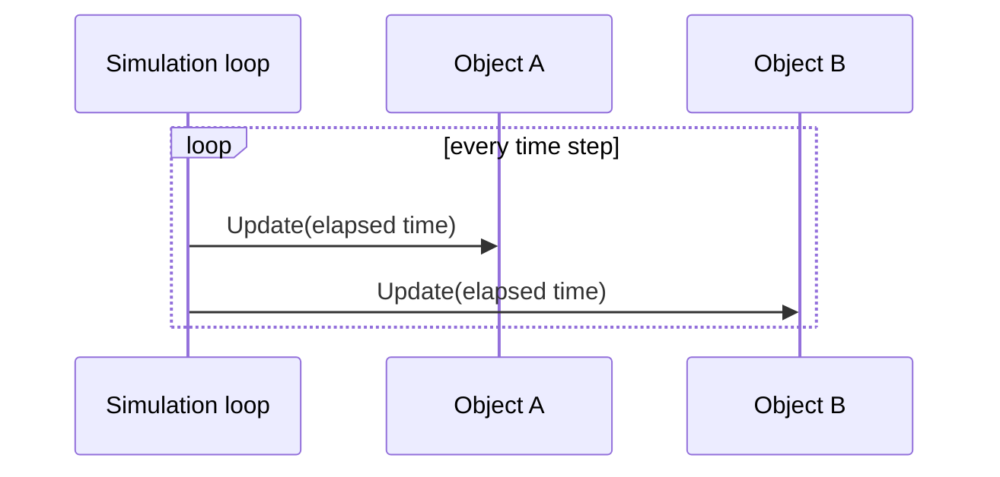
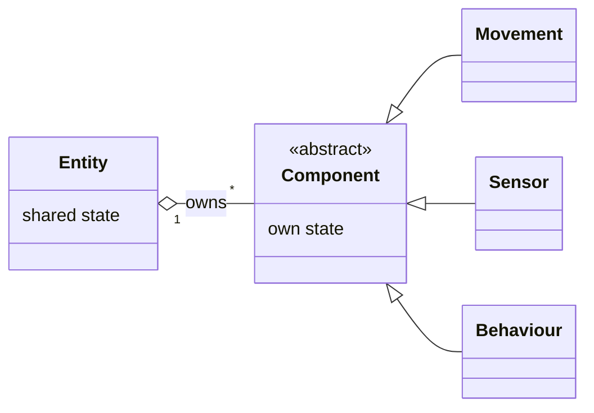
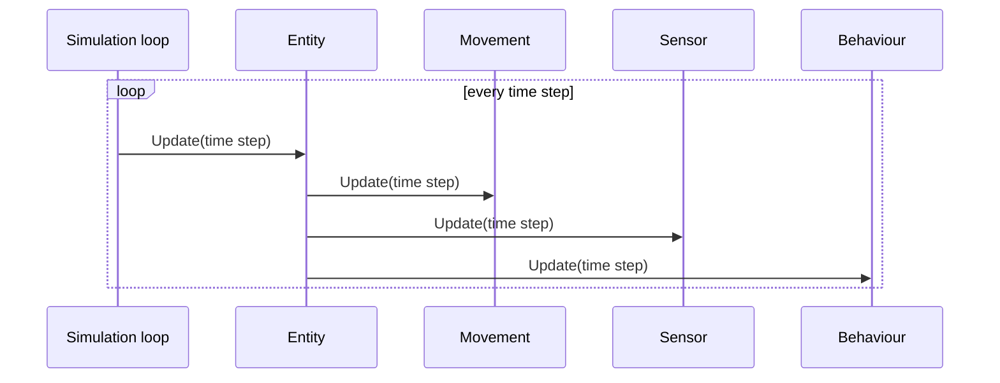

# The Update Method and Component patterns

Invicta.Simulation is a base library for time-stepped simulations. It is built on two design patterns: Update Method
and Component. This document describes both patterns at a high level, based on the sources listed under
[References](#references), and explains why they are so common in time-stepped simulations. It does not describe the
library's own types; [the design document](design.md) does that.

## Time-stepped simulation

A simulation advances a clock and changes the state of the modelled system as the clock moves. The simulation
literature describes two ways to advance the clock ([Averill Law][law]; [Buss and Al Rowaei][buss]):

- **Next-event time advance:** the clock jumps straight to the next scheduled event, and only the state that event
  affects changes. This is discrete-event simulation.
- **Fixed-increment time advance:** the clock moves forward by a fixed step, Δt, and every part of the model updates
  its state for that step. This is time-stepped, or discrete-time, simulation.

Time-stepped simulation is the usual choice for agent-based models, military combat models, continuous systems
described by differential equations, and computer games. Buss and Al Rowaei give its main advantage as simplicity:
"update everything by one step" is easy to understand and matches how differential equations are solved numerically.
They also give its two main costs, which reappear throughout this document:

- **The step size is a hidden parameter:** results can depend on Δt as much as on the model, in the same way that
  Euler integration can diverge when the step is too large.
- **Everything happens at once:** all state changes in a step occur at the same simulated instant, so the order in
  which they are applied must be chosen, and any choice is wrong for some models.

## The Update Method pattern

> Simulate a collection of independent objects by telling each to process one frame of behavior at a time.
> — [Robert Nystrom, *Game Programming Patterns*][nystrom-update]

### Structure

Each object in the simulation owns its behaviour and exposes a single method, usually called `Update`, that advances
that behaviour by one step. The simulation keeps a collection of these objects, and a loop that runs once per step
calls `Update` on each of them in turn.

The loop itself is a separate pattern, [Game Loop][nystrom-loop], which decides when each step runs and how much
simulated time it covers. The Update Method is what each step does.

The pattern appears, under different names, in almost every framework surveyed:

| Framework                    | Updated object    | Per-step method                |
|------------------------------|-------------------|--------------------------------|
| [XNA and MonoGame][monogame] | `GameComponent`   | `Update(GameTime)`             |
| [Unity][unity-monobehaviour] | `MonoBehaviour`   | `Update`, `FixedUpdate`        |
| [Unreal Engine][unreal]      | `UActorComponent` | `TickComponent`                |
| [Stride][stride]             | `SyncScript`      | `Update`                       |
| [Godot][godot]               | `Node`            | `_process`, `_physics_process` |

### Fixed and variable time steps

The loop can pass each object the elapsed time for the step, or it can use a constant step. Nystrom and
[Glenn Fiedler][fiedler] both describe the trade-off:

- **Variable step:** the elapsed real time is passed to every update. The simulation keeps pace with the clock, but
  it is non-deterministic, and physics becomes unstable when a step is unusually long.
- **Fixed step:** every update covers the same Δt. Results are reproducible and stable, which is why physics engines
  and scientific simulations use it.
- **Fixed update with variable rendering:** an accumulator collects real time and runs as many fixed steps as it
  holds; the display then interpolates between the last two states. This keeps a fixed-step model in step with a
  real-time display, at the risk of a "spiral of death" when steps take longer to compute than the time they
  simulate.

Most engines offer both, such as Unity's `FixedUpdate` and `Update`, and Godot's `_physics_process` and `_process`.

### Design questions the pattern raises

Every source that goes beyond the basic loop discusses the same few problems.

- **Update order:** objects update one after another, so objects updated later in a step see the new state of
  objects updated earlier. Nystrom accepts this one-step lag as the price of a deterministic, serialisable state.
  [Jason Gregory][gregory] calls it the "one-frame-off" bug and describes the remedies below.
- **Remedies for ordering problems:**
  - **Explicit order:** XNA's `UpdateOrder` and Unity's script execution order.
  - **Phases:** several passes per step, such as Unity's `FixedUpdate`, `Update` and `LateUpdate`, and Gregory's
    pre-animation and post-animation phases.
  - **Two-phase, or simultaneous, update:** every object computes its next state from the current one, then all
    objects commit at once. Nystrom calls this [Double Buffer][nystrom-double]; Gregory describes the related
    technique of caching each object's previous state.
- **Changing the collection mid-step:** objects created during a step may or may not update in that step, and
  removing an object can skip its neighbour. Nystrom recommends deferring additions and removals until the step ends.
- **Inactive objects:** XNA and Unity give each object an `Enabled` flag; Nystrom suggests a separate list of active
  objects to avoid visiting idle ones.
- **Lifecycle:** objects usually need a hook before their first update and one when they leave the simulation, such
  as XNA's `Initialize`, Unity's `Awake`, `Start` and `OnDestroy`, and Stride's `StartupScript`.
- **Who owns `Update`:** Nystrom lists the entity itself, a delegate object, or the entity's components, and
  recommends components. This is where the two patterns meet.

### Costs

- **Behaviour is sliced into steps:** code that would naturally be a loop, such as "patrol between two points",
  must store where it is and resume on the next call. State machines are the usual answer.
- **Per-object calls are slow at scale:** Gregory notes that a virtual `Update` per object suits small models, but
  large engines batch updates by subsystem for cache efficiency.

## The Component pattern

> Allow a single entity to span multiple domains without coupling the domains to each other.
> — [Robert Nystrom, *Game Programming Patterns*][nystrom-component]

### The problem it solves

The obvious way to model many kinds of entity is a class hierarchy. [Scott Bilas][bilas-slides],
[Kyle Wilson][wilson] and [Mick West][west] each describe how such hierarchies fail as a project grows:

- **Cross-cutting features:** a new kind of object needs behaviour from two branches of the tree, leading to
  multiple inheritance or to hoisting features into the base class.
- **Blob classes:** base classes grow until every object carries state and code that most objects never use.
  Wilson's base class had over four hundred lines of flags and declarations.
- **Fragility:** a change near the root affects every class below it, and restructuring the tree is expensive.
- **Coupling between domains:** one class touches movement, rendering, sound and AI at once, so a change in one
  domain risks another.

Bilas's conclusion, from building *Dungeon Siege*, was that any class tree for game objects is eventually wrong,
because the people designing the content keep asking for combinations that cut across it. The general principle is
the Gang of Four's: [favour object composition over class inheritance][gof].

### Structure

An entity becomes a thin container that owns a set of components. Each component implements one domain of
behaviour, such as movement, sensing or decision-making, together with the state that domain needs. A kind of entity
is defined by which components it holds rather than by which class it is.

Every framework in the Update Method table follows this shape: Unity's `GameObject` holds `MonoBehaviour`
components, Unreal's `AActor` holds `UActorComponent`s, and in *Dungeon Siege* a `Go` held `GoComponent`s.
[Unreal's documentation][unreal] gives a typical motivation: two vehicles that differ only in how they are controlled
share an actor and swap one component.

### Design questions the pattern raises

- **How an entity gets its components:** it can create them itself, which guarantees they exist, or have them
  supplied from outside, which lets one container class represent any kind of entity. Bilas took the second option
  furthest: *Dungeon Siege* assembled over 7,300 object types from data templates, with no code per type.
- **How components communicate:** Nystrom lists three options, and recommends using all three where each fits:
  - **Shared state on the container:** such as a position that several components read. It keeps components
    unaware of each other but makes communication implicit and dependent on update order.
  - **Direct references:** one component looks up a sibling, as with Unity's `GetComponent`. This is simple and fast,
    but couples the two components. West's team started with all access going through a component manager and moved
    to direct references when the manager cost over 5% of CPU time.
  - **Messages through the container:** the container relays a message to every component, as in the Gang of Four's
    Mediator pattern. Senders and receivers stay decoupled, and messages can be queued.
- **Dependencies between components:** some components only make sense with another present. Bilas's schema
  declared these explicitly, for example a `gui` component that requires an `aspect` component.
- **Order within an entity:** Bilas and West both found that component operations become order-dependent, and
  Bilas suggests giving each component a priority. This is the Update Method's ordering problem again, at a smaller
  scale.
- **Hierarchy:** entities can themselves contain entities, as with Unity's transform hierarchy and Godot's scene tree.
  The same idea appears in [Zeigler's DEVS formalism][zeigler], where coupled models are built from atomic models and
  can be nested inside larger coupled models.

### Costs

- **More objects and more wiring:** each entity is several objects that must be created and connected.
- **Indirection:** reaching a behaviour means finding the component first.
- **Risk of spaghetti:** Bilas warns that components tend to talk to each other more and more until they are as
  interdependent as the hierarchy they replaced.
- **Not worth it for small models:** Nystrom notes the extra complexity may not pay off in a small codebase.

### Component compared with Strategy

A component looks like the Gang of Four's Strategy, since the container delegates behaviour to it. Nystrom draws the
distinction: a strategy is usually stateless and interchangeable, whereas a component holds the state that defines
part of what the entity is.

## Using the patterns together

Nystrom recommends putting `Update` on components rather than on entities, and every engine surveyed does so. The
simulation updates each entity, and each entity updates its components; alternatively, the simulation updates every
component directly and entities only group them.

The two patterns share the same concerns, which a library can solve once for both: lifecycle hooks, enabling and
disabling, update order, and adding or removing objects while a step is running.

## Component is not ECS

The Component pattern is often confused with Entity Component System (ECS), which grew out of the same work.
[Adam Martin's 2007 articles][martin] and [Sander Mertens's ECS FAQ][mertens] describe ECS as a distinct architecture:

| Aspect        | Component pattern                               | Entity Component System                      |
|---------------|-------------------------------------------------|----------------------------------------------|
| Entity        | An object that owns its components              | An identifier with no data or behaviour      |
| Component     | A class with state and behaviour                | Plain data with no behaviour                 |
| Behaviour     | In the component, such as its `Update` method   | In systems that act on every matching entity |
| Update        | Per object, through the Update Method           | Per system, over arrays of component data    |
| Main strength | Encapsulation and plain object-oriented design  | Cache-friendly memory layout and parallelism |

Mertens places Unity's `GameObject` model in the first column, as an entity-component framework rather than ECS.
Nystrom treats ECS as an advanced variant reached by combining Component with his [Data Locality][nystrom-locality]
pattern. Invicta uses the Component pattern.

## Why time-stepped simulations use these patterns

- **They mirror fixed-increment time advance:** a time-stepped model is defined as "update every part of the system
  by Δt", and the Update Method is that definition in code. The loop never needs to know what the parts are.
- **Behaviour stays with the state it changes:** each component owns one aspect of an entity and the state for it,
  so a model is built from small units that can be understood, tested and reused alone.
- **Variety without a class explosion:** simulations typically need many kinds of entity that share some behaviours
  and not others, and whose mix changes between experiments. Composition covers these combinations where a
  hierarchy cannot, and Bilas shows that it lets a scenario be described as data.
- **Model variants are cheap:** swapping one component, such as a movement model or a decision rule, gives a
  variant of an entity for comparison or sensitivity analysis without touching the rest of it.
- **Domains stay decoupled:** the model can be kept free of rendering, logging and user input, which live in their
  own components or outside the simulation altogether.
- **Reproducibility can be designed in:** with a fixed step, a defined update order and a seeded random number
  generator, a run can be repeated exactly. Nystrom points out that sequential updating keeps the state deterministic.
- **The problems are well understood:** order dependence, simultaneous change, mid-step creation and destruction,
  and step size are known, and the sources above give established remedies for each.

## What the library needs to decide

The sources suggest that a base library for these patterns must at least settle:

- **Time:** whether steps are fixed, variable or both, and what time information each update receives.
- **Order:** how update order is expressed within the simulation and within an entity, whether phases are
  supported, and whether simultaneous (two-phase) updating is supported.
- **Lifecycle:** what happens when an entity or component is added, first updated, disabled, and removed, and when
  changes made during a step take effect.
- **Composition:** how components are attached and found, how they communicate, and how required components are
  declared.
- **Extension points:** which types simulation code derives from, and which it only uses.

These are the subject of [the design document](design.md).

## References

### Patterns

- **[Game Programming Patterns: Update Method][nystrom-update]:** Robert Nystrom, 2014. The pattern as named here,
  with its design decisions.
- **[Game Programming Patterns: Component][nystrom-component]:** Robert Nystrom, 2014. The pattern as named here,
  including the three ways components communicate.
- **[Game Programming Patterns: Game Loop][nystrom-loop]:** Robert Nystrom, 2014. Fixed and variable time steps.
- **[Game Programming Patterns: Double Buffer][nystrom-double]:** Robert Nystrom, 2014. Updating state that must
  appear to change all at once.
- **[Game Programming Patterns: Data Locality][nystrom-locality]:** Robert Nystrom, 2014. The memory layout concerns
  that lead towards ECS.
- **[Design Patterns: Elements of Reusable Object-Oriented Software][gof]:** Gamma, Helm, Johnson and Vlissides, 1994.
  Composition over inheritance, and the Strategy and Mediator patterns.

### Game object architecture

- **[A Data-Driven Game Object System][bilas-slides]:** Scott Bilas, GDC 2002. The component system of *Dungeon
  Siege*, with its data templates and lessons learnt; see also the [talk proposal][bilas-proposal].
- **[Game Object Structure: Inheritance vs. Aggregation][wilson]:** Kyle Wilson, 2002. The case against deep
  hierarchies.
- **[Evolve Your Hierarchy][west]:** Mick West, 2007. Refactoring Neversoft's *Tony Hawk* games from a hierarchy to
  components.
- **[Game Engine Architecture][gregory]:** Jason Gregory. Chapter on updating game objects in real time, including
  phased and bucketed updates and the one-frame-off problem; the link is an excerpt of that chapter.
- **[Fix Your Timestep!][fiedler]:** Glenn Fiedler, 2004. Fixed, variable and semi-fixed steps, and the accumulator.

### Frameworks

- **[XNA and MonoGame `GameComponent`][monogame]:** `IUpdateable`, `Enabled`, `UpdateOrder` and `Initialize`.
- **[Unity `MonoBehaviour`][unity-monobehaviour] and [order of execution][unity-order]:** components on a
  `GameObject`, and the `Awake`, `Start`, `FixedUpdate`, `Update` and `LateUpdate` lifecycle.
- **[Unreal Engine components][unreal]:** `UActorComponent`, registration and opt-in ticking.
- **[Stride script types][stride]:** a C# engine whose `SyncScript` is updated every frame.
- **[Godot idle and physics processing][godot]:** fixed-rate and per-frame processing on scene tree nodes.

### Simulation

- **[Simulation Modeling and Analysis][law]:** Averill Law, sixth edition 2024; earlier editions with
  David Kelton. The standard text distinguishing next-event and fixed-increment time advance.
- **[A Comparison of the Accuracy of Discrete Event and Discrete Time][buss]:** Arnold Buss and Ahmed Al Rowaei,
  Winter Simulation Conference 2010. Advantages of time stepping and the effect of step size on results.
- **[Theory of Modeling and Simulation][zeigler]:** Bernard Zeigler, Alexandre Muzy and Ernesto Kofman,
  third edition 2018. The DEVS formalism of atomic and hierarchically coupled models.

### Entity Component System

- **[Entity Systems are the future of MMOG development][martin]:** Adam Martin, 2007. The articles that defined ECS.
- **[Entity Component System FAQ][mertens]:** Sander Mertens. Defines ECS and distinguishes it from the
  entity-component model used by Unity.

[bilas-proposal]: https://this.scottbilas.com/files/pubs/2002/gdc-san-jose/GDC%20Game%20Objects%20Proposal.pdf
[bilas-slides]: https://www.gamedevs.org/uploads/data-driven-game-object-system.pdf
[buss]: https://www.informs-sim.org/wsc10papers/135.pdf
[fiedler]: https://gafferongames.com/post/fix_your_timestep/
[godot]: https://docs.godotengine.org/en/stable/tutorials/scripting/idle_and_physics_processing.html
[gof]: https://en.wikipedia.org/wiki/Design_Patterns
[gregory]: https://www.gamedeveloper.com/programming/book-excerpt-game-engine-architecture
[law]: https://www.averill-law.com/simulation-book/
[martin]: https://t-machine.org/index.php/2007/09/03/entity-systems-are-the-future-of-mmog-development-part-1/
[mertens]: https://github.com/SanderMertens/ecs-faq
[monogame]: https://docs.monogame.net/api/Microsoft.Xna.Framework.GameComponent.html
[nystrom-component]: https://gameprogrammingpatterns.com/component.html
[nystrom-double]: https://gameprogrammingpatterns.com/double-buffer.html
[nystrom-locality]: https://gameprogrammingpatterns.com/data-locality.html
[nystrom-loop]: https://gameprogrammingpatterns.com/game-loop.html
[nystrom-update]: https://gameprogrammingpatterns.com/update-method.html
[stride]: https://doc.stride3d.net/latest/en/manual/scripts/types-of-script.html
[unity-monobehaviour]: https://docs.unity3d.com/ScriptReference/MonoBehaviour.html
[unity-order]: https://docs.unity3d.com/Manual/execution-order.html
[unreal]: https://dev.epicgames.com/documentation/en-us/unreal-engine/components-in-unreal-engine
[west]: https://cowboyprogramming.com/2007/01/05/evolve-your-heirachy/
[wilson]: http://gamearchitect.net/Articles/GameObjects1.html
[zeigler]: https://www.sciencedirect.com/book/monograph/9780128133705/theory-of-modeling-and-simulation
